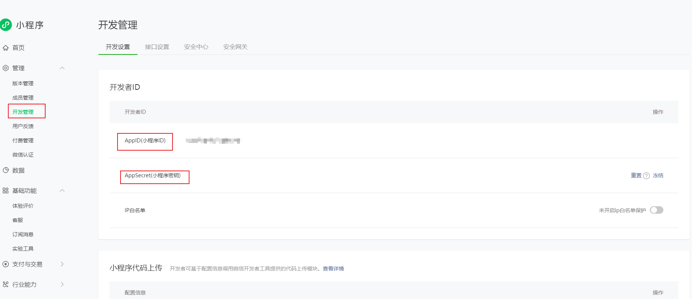
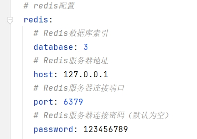
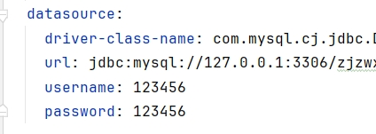
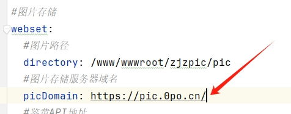
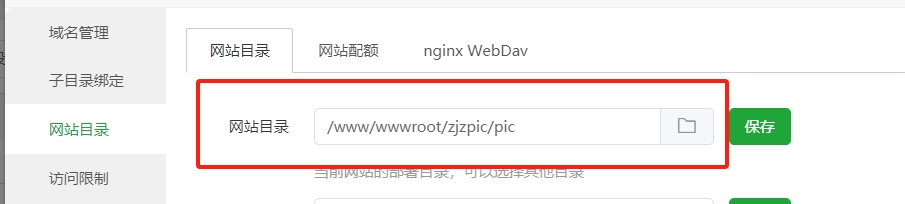
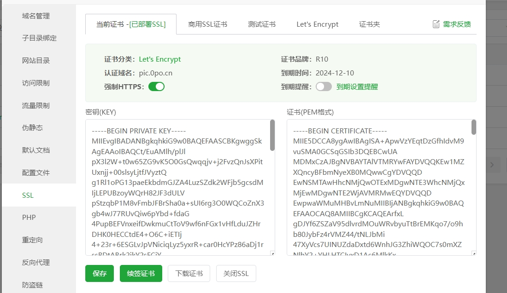
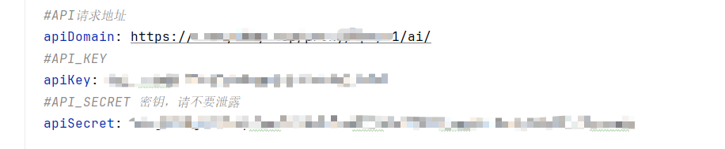
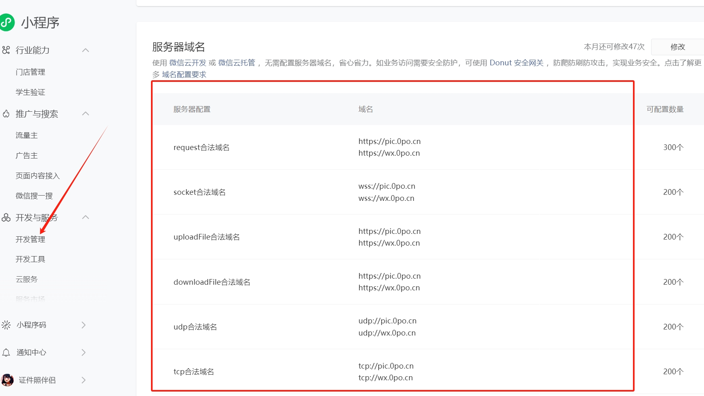

# 🔧部署

环境工作准备：

1. 
- jdk=1.8
- mysql=8.0或5.7
- redis=7.2.4或任意版本

2. 
- Mysql导入1.sql
- 打开web_set表，配置app_id，app_secret，来源于微信小程序，如下图；
- 至此Mysql配置完毕
- 

3.
- IDEA导入项目 
- 打开application.yml
- 按下图进行一步步配置

##### 修改Redis：

##### 修改Mysql：

##### 修改图片存储地址：

解释：

你需要一个新建一个静态网站，将目录指定：/www/wwwroot/zjzpic/pic

然后，配置SSL证书，开启https，并把【图片存储服务器域名】换成你的

##### 修改API接口地址：

 

# ⚡️注意
1. 如果因为动漫风图片导致小程序不过审核，解决办法：管理员后台关闭这个功能，然后去提交审核，等审核通过后再开启
2. 鉴黄模型目前不怎么精准，建议在小程序过审时打开，其它时间关闭
3. 当你部署到云上（服务器）时，别忘记配置你的小程序域名(如图，JAVA后端域名+图片存储服务器域名) 

 